<div align="center">

# No One Gets an A

### Distributional Bias in LLM Text Scoring

*Idrees Aziz · Mahir Sadikhov*

[](paper/paper.tex)
[](requirements.txt)
[](#license)

**When large language models rate text quality on a 0–10 scale, they never give a 0 or a 10.**
**Not once across 18,000 evaluations.**

</div>

---

## The Core Finding

LLMs systematically compress their scores into a narrow interior band, regardless of true quality variation. Expert-authored, editorially curated articles top out at 8–9. Heavily corrupted, barely readable text bottoms out at 2–3. The full scale is never used.

<p align="center">
  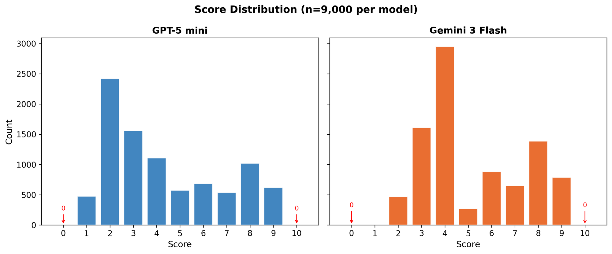
</p>
<p align="center"><em>Overall score distributions (n = 9,000 per model). Red arrows mark scores of 0 and 10 — never assigned by either model.</em></p>

We call this **score compression**: the effective scoring range shrinks to **62–69%** of ideal, confirmed across two frontier models from different providers.

| | GPT-5 mini | Gemini 3 Flash |
|---|:---:|:---:|
| **Samples scored** | 9,000 | 9,000 |
| **Observed range** | 1–9 | 2–9 |
| **Mean score** | 4.32 | 5.21 |
| **Compression ratio** | 0.685 (CI: 0.668–0.700) | 0.621 (CI: 0.603–0.634) |
| **Times a 0 was given** | 0 | 0 |
| **Times a 10 was given** | 0 | 0 |

---

## Table of Contents

- [The Core Finding](#the-core-finding)
- [Key Results](#key-results)
  - [Pristine Texts Never Get a 10](#pristine-texts-never-get-a-10)
  - [The Compression Gap](#the-compression-gap)
  - [Dose-Response Curves](#dose-response-curves)
  - [Axis-Specific Sensitivity](#axis-specific-sensitivity)
  - [Inter-Model Agreement and Bias](#inter-model-agreement-and-bias)
  - [Score Distributions by Degradation Level](#score-distributions-by-degradation-level)
  - [Scoring Consistency](#scoring-consistency)
  - [Category Effects](#category-effects)
  - [Calibration Recovery](#calibration-recovery)
  - [Residual Diagnostics](#residual-diagnostics)
- [Experimental Design](#experimental-design)
- [Degradation Engine](#degradation-engine)
- [Scoring Protocol](#scoring-protocol)
- [Repository Structure](#repository-structure)
- [Running the Pipeline](#running-the-pipeline)
- [Citation](#citation)
- [License](#license)

---

## Key Results

### Pristine Texts Never Get a 10

Even undegraded, expert-authored articles — written by academics and professionally edited — never receive a perfect score from either model.

<p align="center">
  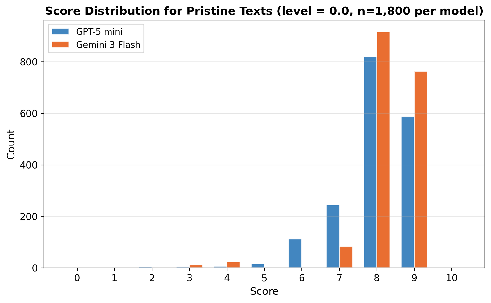
</p>
<p align="center"><em>Score distribution for pristine (λ = 0.0) texts only (n = 1,800 per model). Both models concentrate at 8–9; neither ever assigns 10.</em></p>

### The Compression Gap

Both models fall short of the ideal calibration line. The shaded area below is scoring range that is lost to boundary avoidance.

<p align="center">
  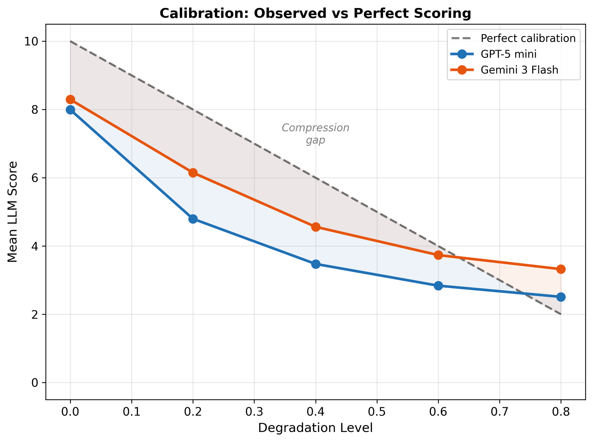
</p>
<p align="center"><em>Observed mean scores vs. the naive calibration reference line S = 10(1 − λ). The shaded region represents the compression gap.</em></p>

### Dose-Response Curves

Both models respond to degradation — scores drop as quality worsens — but with only ~65% of ideal sensitivity and a visibly concave shape.

<p align="center">
  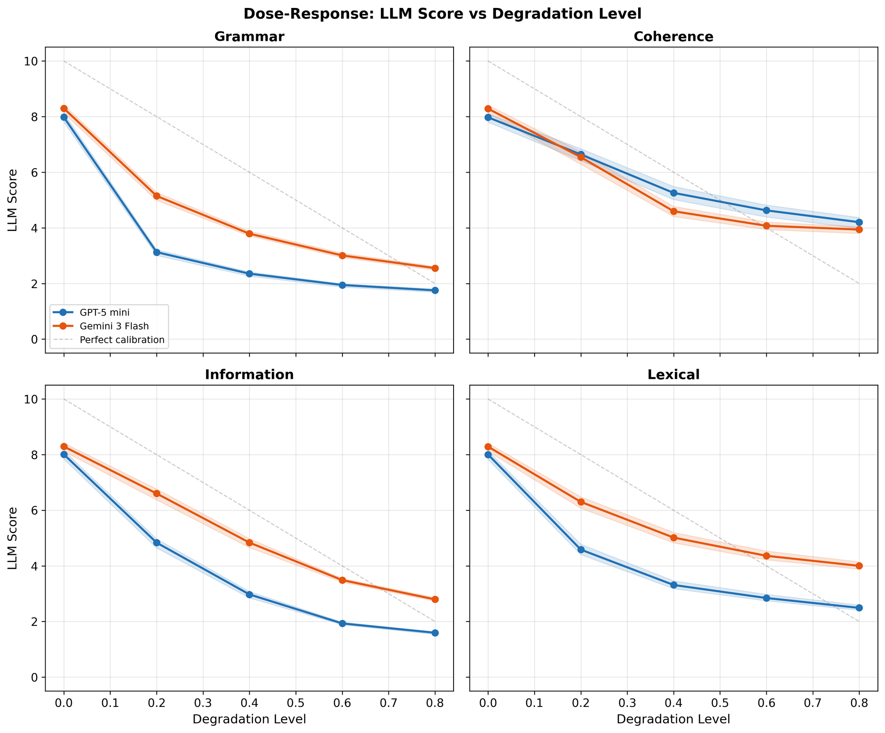
</p>
<p align="center"><em>Mean LLM score vs. degradation level for each axis. Shaded bands = 95% bootstrap CIs. Dashed gray = ideal linear reference. Note the concave trajectory — sensitivity diminishes at higher degradation.</em></p>

### Axis-Specific Sensitivity

Both models are most sensitive to **information deletion** and least sensitive to **coherence disruption** — suggesting they weight local sentence features more heavily than global discourse structure.

<p align="center">
  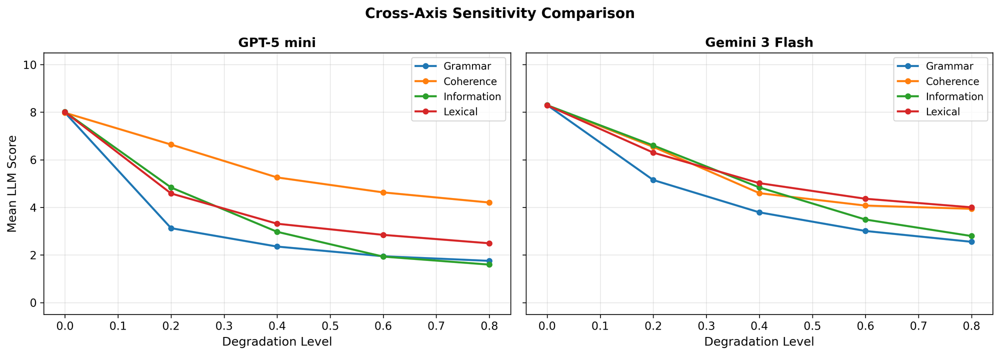
</p>
<p align="center"><em>Cross-axis sensitivity comparison. Information deletion elicits the steepest score drops; coherence disruption the shallowest.</em></p>

<p align="center">
  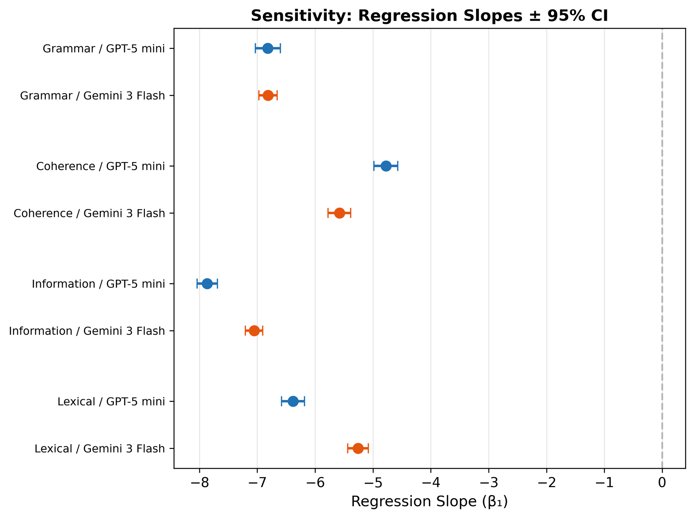
</p>
<p align="center"><em>Forest plot of regression slopes (β₁) with 95% CIs for each axis × model combination. All slopes are significantly negative (p < 10⁻³⁰⁰).</em></p>

| Axis | GPT-5 mini β₁ (SE) | GPT R² | Gemini β₁ (SE) | Gemini R² |
|---|:---:|:---:|:---:|:---:|
| Grammar | −6.82 (0.11) | 0.63 | −6.81 (0.08) | 0.76 |
| Coherence | −4.78 (0.11) | 0.47 | −5.58 (0.10) | 0.58 |
| Information | −7.87 (0.09) | 0.78 | −7.05 (0.08) | 0.79 |
| Lexical | −6.38 (0.10) | 0.64 | −5.26 (0.09) | 0.60 |
| **Average** | **−6.46** | | **−6.18** | |

Under ideal linear calibration, the expected slope is −10. Both models achieve only 62–65% of that sensitivity.

### Inter-Model Agreement and Bias

Despite high correlation (Pearson *r* = 0.84), Gemini systematically scores **+1 point higher** than GPT on the same texts (Wilcoxon *p* < 10⁻³⁰⁰, rank-biserial *r* = 0.71).

<p align="center">
  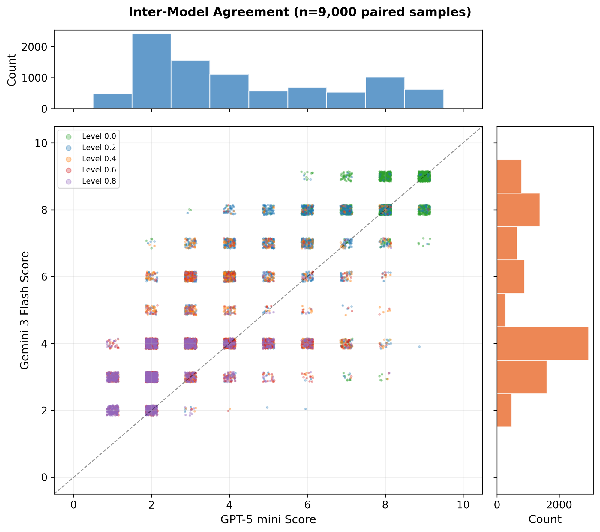
</p>
<p align="center"><em>Inter-model agreement (n = 9,000 paired samples). Points above the identity line indicate Gemini scored higher. Colored by degradation level.</em></p>

<p align="center">
  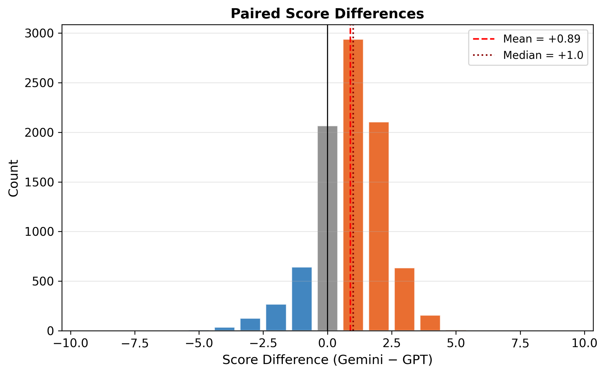
</p>
<p align="center"><em>Distribution of paired score differences (Gemini − GPT). Right-shifted with median +1, confirming systematic positive bias.</em></p>

> **Practical implication:** Scores from different LLM providers are not interchangeable. A threshold calibrated on GPT scores will systematically fail if applied to Gemini scores.

### Score Distributions by Degradation Level

<p align="center">
  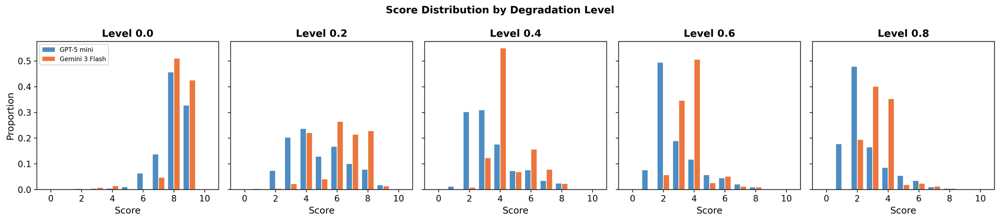
</p>
<p align="center"><em>Score distributions by degradation level. At λ = 0.0, scores cluster at 8–9. At λ = 0.8, they reconcentrate at 2–4.</em></p>

<p align="center">
  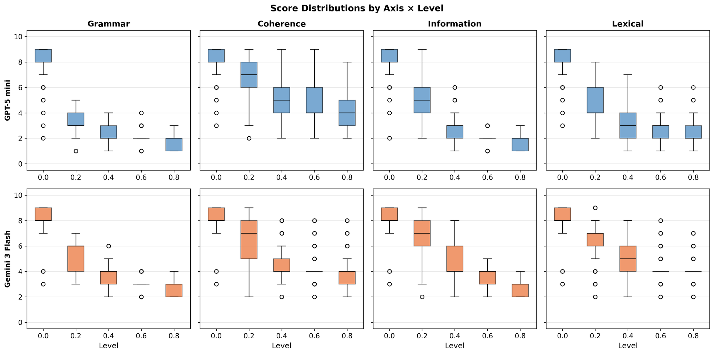
</p>
<p align="center"><em>Boxplots by axis and degradation level. IQR is narrowest at the extremes, reflecting ceiling and floor compression.</em></p>

<p align="center">
  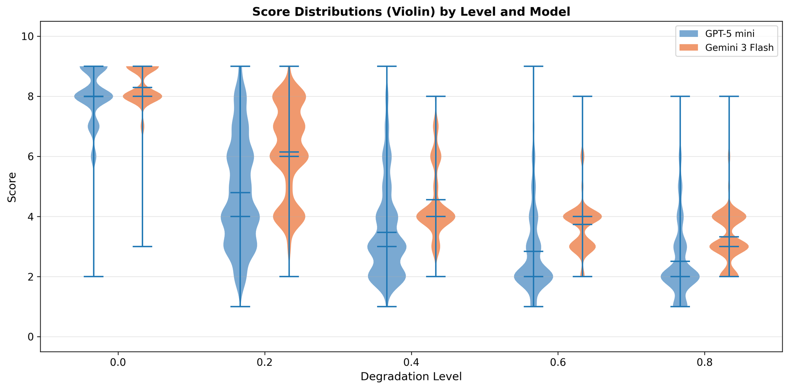
</p>
<p align="center"><em>Violin plots by degradation level and model. The bimodal shape at λ = 0.2 reflects the mixture as degradation begins to take effect.</em></p>

### Scoring Consistency

Both models achieve excellent intra-condition reliability (ICC > 0.90). Gemini reaches near-perfect consistency on pristine texts (ICC = 0.989 at λ = 0.0) at temperature 0.

<p align="center">
  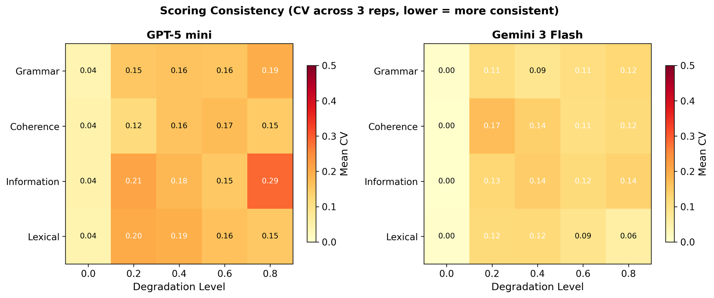
</p>
<p align="center"><em>Mean coefficient of variation (CV) across 3 repetitions, by axis and degradation level. Lighter = more consistent.</em></p>

| Axis | GPT-5 mini ICC | Gemini ICC |
|---|:---:|:---:|
| Grammar | 0.963 | 0.950 |
| Coherence | 0.850 | 0.844 |
| Information | 0.925 | 0.913 |
| Lexical | 0.897 | 0.890 |
| **Overall** | **0.926** | **0.905** |

### Category Effects

Even among expert-authored articles from a single platform, LLMs exhibit domain-dependent scoring preferences.

<p align="center">
  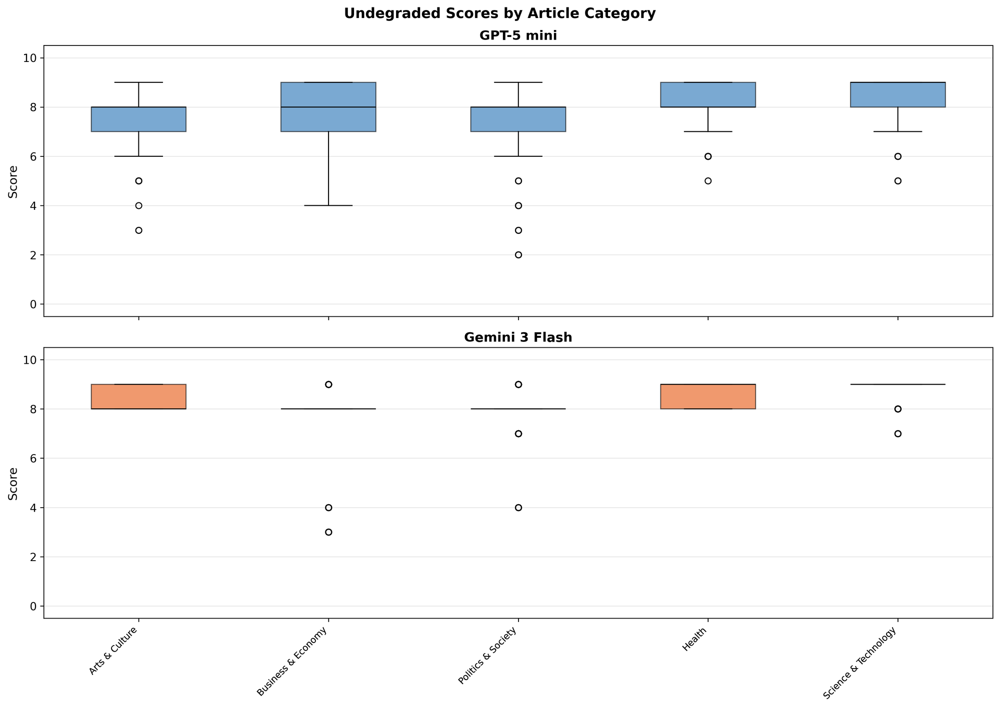
</p>
<p align="center"><em>Undegraded scores by article category. Both models score Science & Technology highest and Politics & Society lowest.</em></p>

### Calibration Recovery

Can the bias be corrected? A simple two-parameter affine transform reduces RMSE by **12–27%** — but a residual error of ~1.6–1.9 points persists even with the best possible monotonic calibration (isotonic regression).

<p align="center">
  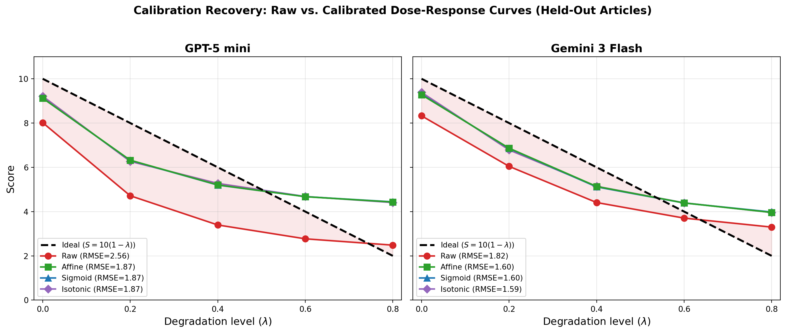
</p>
<p align="center"><em>Dose-response curves before and after calibration. Affine, sigmoid, and isotonic methods all converge — the residual reflects irreducible rank-order noise.</em></p>

| Model | Calibration | RMSE | ΔRMSE |
|---|---|:---:|:---:|
| GPT-5 mini | Raw | 2.56 | — |
| | Affine | 1.87 | −27% |
| | Isotonic | 1.87 | −27% |
| Gemini 3 Flash | Raw | 1.82 | — |
| | Affine | 1.60 | −12% |
| | Isotonic | 1.59 | −13% |

**Dual takeaway:** (1) A cheap affine fix recovers meaningful accuracy. (2) The models genuinely lose discriminative information that no rescaling can recover.

### Residual Diagnostics

<p align="center">
  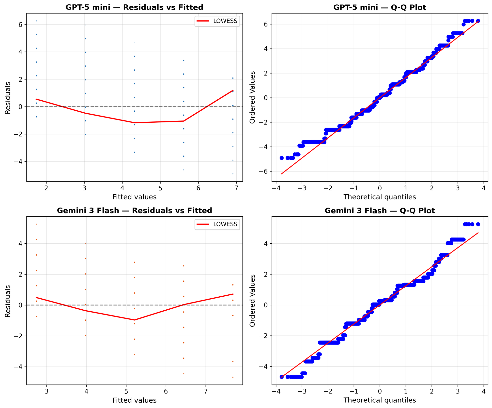
</p>
<p align="center"><em>Residuals vs. fitted values (left) with LOWESS smoother showing systematic curvature. Q-Q plots (right) show heavy-tailed, discrete residuals — expected for bounded integer scores.</em></p>

---

## Experimental Design

**150 articles × 4 axes × 5 levels × 3 repetitions = 9,000 samples per model**

| Component | Detail |
|---|---|
| **Corpus** | 150 expert-authored articles from [The Conversation](https://theconversation.com), across 5 categories |
| **Degradation axes** | Grammar, Coherence, Information, Lexical — each applied in isolation |
| **Intensity levels** | λ ∈ {0.0, 0.2, 0.4, 0.6, 0.8} — capped at 0.8 to keep texts parseable |
| **Repetitions** | 3 per condition for reliability estimation |
| **Models** | GPT-5 mini (OpenAI, T=1.0) and Gemini 3 Flash (Google, T=0.0) |
| **Prompt** | Minimal: *"Rate the quality of the following text from 0 to 10. Respond with ONLY the number."* |

Each sample is degraded along exactly **one** axis, isolating quality dimensions so scoring biases can be attributed to specific aspects rather than confounded combinations.

---

## Degradation Engine

The degradation engine ([`src/degradation.py`](src/degradation.py)) corrupts clean texts along four independent axes at controlled intensity. At λ = 0, the original text is returned unchanged. All randomness is deterministic via MD5-seeded RNG.

| Axis | Method | What it preserves |
|---|---|---|
| **Grammar** | 9-stage pipeline: typos, agreement errors, tense swaps, article errors, homophones, preposition errors, double comparatives, hyphenation errors, word-order disruption | Meaning, vocabulary, information |
| **Coherence** | Bounded random sentence swaps with controlled displacement distance | All content, grammar, vocabulary |
| **Information** | 5-phase deletion pipeline: parentheticals → modifiers → prepositional phrases → subordinate clauses → content words | Grammar, sentence structure |
| **Lexical** | GloVe-based synonym replacement, collapsing diverse vocabulary to common alternatives with morphological transfer | Meaning, grammar, information |

All randomness is deterministic via MD5-seeded RNG:

```
seed = MD5(title ∥ axis ∥ level ∥ rep) mod 2³¹
```

A fresh `random.Random(seed)` per sample ensures bitwise-identical results across machines, OSes, and Python versions.

---

## Scoring Protocol

Each sample is scored in isolation with a minimal, unanchored prompt:

- **System**: *"Rate the quality of the following text from 0 to 10. Respond with ONLY the number."*
- **User**: The degraded text, wrapped in delimiters.

No rubric, examples, or reference texts — measuring intrinsic calibration only.

| Model | Provider | Temperature | Notes |
|---|---|:---:|---|
| GPT-5 mini | OpenAI | 1.0 | Reasoning model; T=1.0 is the only supported value |
| Gemini 3 Flash | Google | 0.0 | Minimal thinking; deterministic decoding |

---

## Repository Structure

```
├── config.yaml                  # Experiment configuration
├── requirements.txt             # Python dependencies
├── paper/
│   └── paper.tex                # Full LaTeX manuscript
├── src/
│   ├── main.py                  # Pipeline orchestrator
│   ├── corpus.py                # Article fetcher
│   ├── degradation.py           # Four-axis degradation engine
│   ├── quality.py               # Objective quality function
│   ├── llm_scoring.py           # LLM scoring with checkpointing
│   └── analysis.py              # Statistical analysis & figures
├── scripts/
│   ├── generate_graphs.py       # Standalone figure generation
│   ├── run_analysis.py          # Full analysis pipeline
│   ├── calibration_recovery.py  # Calibration experiment
│   └── sanity_check.py          # Quick degradation checks
├── data/
│   ├── corpus/                  # 150 article texts (regenerate via pipeline)
│   ├── degraded/                # 9,000 degraded samples
│   └── scores/                  # Raw LLM scores (committed)
│       ├── gpt5_mini_scores.json
│       └── llm_scores_gemini.json
└── output/
    ├── analysis/                # Statistical results (JSON/CSV)
    └── figures/                 # All 15 generated figures
```

---

## Running the Pipeline

### Prerequisites

```bash
pip install -r requirements.txt
```

The lexical axis requires [GloVe 840B 300d](https://nlp.stanford.edu/data/glove.840B.300d.zip) vectors (~2.2 GB). Extract `glove.840B.300d.txt` into `src/`. NLTK resources download automatically on first run.

### API Keys

```bash
cp .env.example .env
# OPENAI_API_KEY=sk-...
# GOOGLE_API_KEY=...
```

### Execution

```bash
# Full pipeline
python -m src.main

# Individual steps
python -m src.main --step corpus      # Fetch articles
python -m src.main --step degrade     # Generate degraded samples
python -m src.main --step llm         # Score with LLMs
python -m src.main --step analysis    # Generate figures

# Standalone graph generation (from existing data)
python scripts/generate_graphs.py
```

---

## Citation

If you use this work, please cite:

```bibtex
@article{aziz2026noone,
  title={No One Gets an A: Distributional Bias in LLM Text Scoring},
  author={Aziz, Idrees and Sadikhov, Mahir},
  year={2026}
}
```

---

## License

This project is released under the MIT License.
